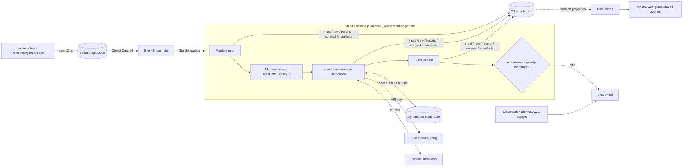

# people-enrichment-pipeline

Serverless ETL on AWS that takes a CSV of event registrants (first name, last name,
optionally email, company, location or LinkedIn URL), enriches each person through a free
people-profile API, and lands analyst-ready Parquet tables in S3, registered in Glue and
queryable in Athena: who the individuals are, which companies they have worked at and
which roles they have held. Everything is provisioned with Terraform, nothing is reachable
from the internet, and the whole thing runs inside AWS Free-plan credits and the
provider's free monthly credits.

**Status:** `v1.0.0`. Built and verified on a personal AWS Free-plan account on
2026-09-25 and 2026-09-26 with live People Data Labs data; destroyed and rebuilt from
nothing on 2026-09-26 to prove reproducibility. [PLAN.md](PLAN.md) is the build plan with
its phase log; `docs/adr/` holds the decision records; [docs/architecture.md](docs/architecture.md)
has the component and IAM detail.



## Contents

1. [Quick start](#quick-start)
2. [Architecture](#architecture)
3. [Data model and the three questions](#data-model-and-the-three-questions)
4. [Assumptions](#assumptions)
5. [Failure handling and API limits](#failure-handling-and-api-limits)
6. [Data guards](#data-guards)
7. [Security](#security)
8. [Cost](#cost)
9. [Development](#development)
10. [Limitations and next steps](#limitations-and-next-steps)
11. [Appendix: provider findings and live runs](#appendix-provider-findings-and-live-runs)

## Quick start

**Prerequisites:** Terraform ≥ 1.16, AWS CLI v2, `uv`, `jq`, GNU make; an AWS account
(a new account on the Free plan cannot be charged) with a CLI profile named `enrich-dev`
(`aws login --profile enrich-dev` gives 12-hour browser-based sessions, no access keys);
a People Data Labs free-plan API key for live runs (`make run` works without one).

### Locally, no AWS account

```bash
make setup                              # uv sync + git hooks
make check                              # ruff + 134 tests (unit, provider contract, mocked-AWS handlers)
make run                                # data/sample/names.csv through the offline mock provider -> ./out
make run INPUT=data/sample/dirty.csv    # the data guards at work: salvaged fields, rejected rows, warnings
make query                              # the three questions answered from ./out with DuckDB
```

### Deploy to AWS

```bash
make login          # browser sign-in for a 12-hour CLI session
make bootstrap      # once per account: Terraform state bucket + account-level S3 public access block
cp infra/envs/dev/terraform.tfvars.example infra/envs/dev/terraform.tfvars   # set alert_email, provider_name
make init           # point infra/envs/dev at the state bucket (native S3 locking)
make apply          # package the Lambda code (arm64 wheels from uv.lock) and create ~80 resources
                    # -> confirm the SNS subscription email that arrives
make set-api-key    # push ~/.config/people-enrichment/pdl_api_key into the SSM SecureString
make e2e INPUT=data/demo/idempotency.csv   # upload 5 public figures (about 4 credits), follow the execution, count the batch in Athena
make athena-verify  # run the five saved queries and print the first rows
make destroy        # tear everything down (dev buckets are force_destroy)
```

The bootstrap stack keeps its own state locally in `infra/bootstrap/terraform.tfstate`
(git-ignored) because there is nowhere else to put it yet; keep that file, or on a second
machine run `terraform -chdir=infra/bootstrap import` for the existing bucket before
`make init`. Every other stack stores state in the bucket with native S3 locking.

Where to look afterwards: the Step Functions console shows one execution per upload; the
data bucket holds `raw/`, `results/`, `curated/` and `manifests/<batch_id>.json`; the
Athena workgroup `people-enrichment-dev-analytics` has the saved queries; the alerts email
receives failures, batches completed with warnings, and alarm notifications.

## Architecture

| Component | Role |
|---|---|
| S3 landing bucket | `incoming/<folder>/<file>.csv` uploads start the pipeline; objects expire after 30 days |
| EventBridge rule | `Object Created` under `incoming/` → `StartExecution`; undeliverable events go to a dead-letter queue |
| Step Functions Standard | `ValidateInput` → `EnrichRows` (inline Map, `MaxConcurrency` 1) → `BuildCurated` → summarise; failures and warnings to SNS |
| 3 Lambda functions (Python 3.13, arm64) | `validate-input` (guards, parsing), `enrich` (matching ladder, cache, budget, provider call), `build-curated` (reconciliation, output guards, Parquet) |
| DynamoDB state table | idempotency cache `lookup#…` (TTL 90 days), monthly and per-batch credit counters `budget#…`, batch claims `batch#…` (one execution per upload); provisioned 5/5 |
| SSM SecureString | the provider API key; Terraform creates a placeholder and ignores the value |
| S3 data bucket | `input/`, `raw/` (90-day TTL), `results/`, `curated/<table>/batch_date=…/<batch_id>.parquet`, `manifests/`, `quarantine/` (rejected uploads and rejected-row exports, 90-day TTL), `athena-results/` (7-day TTL) |
| Glue database + Athena workgroup | three tables generated from `schema.py` with partition projection; encrypted results, 100 MB scan cutoff, five saved queries |
| SNS topic, CloudWatch, AWS Budget | email alerts; eight alarms; $5 monthly budget |

**Why these choices** (full reasoning in the ADRs):

- **Step Functions** ([ADR 0002](docs/adr/0002-orchestration.md)) gives one execution per
  batch with a visual history, built-in retry and catch, a concurrency cap for the
  provider's rate limit, and a natural "batch complete" point to write one Parquet file per
  table. Retries for provider errors live inside the function, so they cost no state
  transitions and the same code runs locally.
- **Parquet + Glue + Athena** ([ADR 0003](docs/adr/0003-storage-format.md)): typed,
  columnar, plain SQL for analysts, nothing to run, and partition projection means a new
  batch is queryable the moment its file lands, with no crawler.
- **DynamoDB for idempotency and the credit guard** ([ADR 0004](docs/adr/0004-idempotency-and-credit-guard.md)):
  strongly consistent cache hits and atomic counters shared by every invocation, inside the
  always-free capacity.
- **People Data Labs behind a provider interface** ([ADR 0001](docs/adr/0001-enrichment-provider.md)):
  named in the brief, returns dated employment history, has a free sandbox; the mock
  provider exercises every outcome offline.

## Data model and the three questions

One Parquet file per table per batch, Hive-partitioned by `batch_date`. Columns are
declared once in `src/enrich_pipeline/schema.py`; the transform, the Parquet writer and the
Glue tables (`make glue-columns`, drift fails a test) all derive from it.

| Table | One row per | Key columns |
|---|---|---|
| `dim_person` | matched person per batch | `person_id`, `batch_id`, `full_name`, `current_job_title`, `current_company_name`, `location_country`, `linkedin_url`, `match_likelihood`, `lookup_method`, `quality_flags`, input lineage (`input_first_name`, …) |
| `fact_employment` | position held | `person_id`, `batch_id`, `sequence_no` (0 = current), `company_name`, `company_industry`, `title_name`, `title_role`, `title_levels`, `start_date`, `end_date`, `is_current` |
| `fact_lookup` | input row, valid or not | `batch_id`, `row_number`, `status`, `lookup_method`, `person_id`, `likelihood`, `http_status`, `error_message`, `credits_consumed`, `raw_ref`, `quality_flags` |

The saved Athena queries (also in [docs/athena_queries.sql](docs/athena_queries.sql)):

```sql
-- 1. Who are the individuals identified?
SELECT full_name, current_job_title, current_company_name, location_country,
       match_likelihood, quality_flags
FROM people_enrichment_dev.dim_person
WHERE batch_date = '2026-09-25';

-- 2. What companies have they worked at?
SELECT p.full_name, e.company_name, e.company_industry, e.start_date, e.end_date, e.is_current
FROM people_enrichment_dev.fact_employment e
JOIN people_enrichment_dev.dim_person p
  ON p.person_id = e.person_id AND p.batch_id = e.batch_id AND p.batch_date = e.batch_date
ORDER BY p.full_name, e.sequence_no;

-- 3. What roles have they held?
SELECT p.full_name, e.title_name, e.title_role, e.title_levels, e.company_name
FROM people_enrichment_dev.fact_employment e
JOIN people_enrichment_dev.dim_person p
  ON p.person_id = e.person_id AND p.batch_id = e.batch_id AND p.batch_date = e.batch_date
ORDER BY p.full_name, e.sequence_no;
```

Query 4 is the operational view (status, method, credits per batch) and query 5 the
**latest snapshot per person**, because `dim_person` is a per-batch snapshot: a person
uploaded twice appears once per batch. The same logic is also a Glue view,
**`person_current`**, created by Terraform, so `SELECT * FROM person_current` answers
"who are the individuals" across every upload with one row per person. `make athena-verify` runs all five; on 2026-09-26,
on the rebuilt stack, they each scanned 9 to 34 KB in under 1.4 s. The largest live batch answers question 1
with 17 public-company executives, and questions 2 and 3 with their dated positions and
titles (for example Nasdaq, executive vice president of corporate strategy, VP level).

## Assumptions

- **Input.** A CSV with a header; `first_name` and `last_name` are required (aliases such
  as `First Name`, `Surname` are recognised); `email`, `company`, `location` and
  `linkedin_url` are optional and used when present. The brief's objective mentions email
  addresses while its problem statement gives names; the pipeline uses the strongest
  identifier each row has.
- **A name alone is a weak identifier.** Name-only rows go through the provider's
  identify call behind a confidence gate (top candidate score ≥ 70 and 20 points clear of
  the runner-up); otherwise the row is recorded as `ambiguous` rather than guessed. Because
  identify costs a credit whether or not it matches and the free plan grants only five a
  month, inputs should carry a company or location column whenever the registration system
  has one.
- **Provider.** People Data Labs on its free plan; the adapter interface, the mock provider
  and recorded sandbox fixtures keep the pipeline demonstrable if credits run out or the
  provider changes its plan (comparison of eight providers in ADR 0001).
- **Networking.** Functions run outside a VPC because they only make outbound HTTPS calls;
  a VPC attachment would need a NAT gateway, which is not free. `lambda_vpc_config`
  attaches them to existing private subnets when a network boundary is required.
- **Scope.** One account, one region (`ap-southeast-1`), one environment (`dev`); another
  environment is a copy of `infra/envs/dev` with its own state key. Inline Map caps a
  file at 500 rows (`max_rows`); larger files are split or need Distributed Map.
- **Free tier.** Credits bound the run size: 100 enrichment and 5 identify credits a
  month at the provider; self-imposed ceilings of 70 and 2 keep a reserve. The design
  scales by raising the ceilings and the concurrency, not by changing shape.
- **PII.** Only what the three questions need is stored: names, employer and title
  history, country, LinkedIn URL, match score. Contact fields the provider returns are
  never stored; the free plan obscures them anyway. Logs carry ids and counts, never names.
  Enriching event registrants in production would need a lawful basis (PDPA/GDPR) and a
  retention policy; the lifecycle rules here (raw 90 days, landing 30 days) are a starting
  point.
- **Credit accounting** trusts the provider's `x-call-credits-spent` header (1 assumed when
  absent on a billable call); the DynamoDB counter is the source of truth for the guard.
  `x-totallimit-remaining` is reported but not reconciled, because it includes spend from
  outside this pipeline.

## Failure handling and API limits

| Concern | What the pipeline does |
|---|---|
| Rate limit (HTTP 429) | The enrich function reads `x-ratelimit-reset` (a UTC timestamp at this provider) or `Retry-After`, sleeps until the window reopens (capped at 20 s), and retries up to three attempts inside its 90 s timeout. `MaxConcurrency` 1 keeps even an all-name-only batch under the 10-per-minute identify limit. |
| Transient 5xx or network errors | Exponential backoff inside the function; the Map retries Lambda service errors (2 s, ×2, jitter, 3 attempts). Every call is idempotent through the cache key, so a retry never double-spends. |
| Credit exhaustion | Per-pool monthly counters in DynamoDB (`enrich` 70, `identify` 2, below the plan's 100 and 5) are checked before every billable call; rows past a ceiling are `budget_deferred` and the batch still completes. An HTTP 402 marks that pool exhausted for the month so the remaining rows skip the call. Alarms fire at 90 % of each ceiling. |
| Duplicate names, re-uploaded files | Normalised lookup key (NFKC, casefold, punctuation and whitespace folded, plus the identifiers and thresholds used) → DynamoDB cache with a 90-day TTL; a hit costs nothing and reuses the stored profile. Proof on 2026-09-26: first upload 4 matched, 1 not found, 1 invalid, **4 credits**; second upload of the same file 5 `cached`, 1 invalid, **0 credits**, identical persons and positions. |
| Duplicate trigger events | S3 notifications and EventBridge deliver at least once. The batch id is derived from the object version and the first execution to claim it in DynamoDB (conditional write) owns it; a second delivery ends in `DuplicateIgnored` with no rows enriched. Verified by starting a second execution with an identical input. |
| One upload spending the month | `max_credits_per_batch` (default 40) is enforced through a per-batch counter beside the monthly ones; rows past the cap are `budget_deferred` with `credit budget: batch cap (40) reached`. |
| Bad files and rows | See [Data guards](#data-guards): a file that cannot be processed fails the batch with the reason **and is kept under `quarantine/files/` with that reason as object metadata**; rows a batch rejects are exported to `quarantine/rows/<batch_id>.csv` for the source owner. `make quarantine` lists both, `make quarantine-get` downloads, `make redrive` re-submits a quarantined file (a new object, so never a duplicate). |
| Provider payload changes | pydantic models with `extra="ignore"`, obscured `true`/`false` values coerced to null, contract tests against recorded sandbox and live fixtures; raw JSON is kept so the curated tables can be rebuilt. |
| Partial batch failure | A row whose invocation crashes or times out after retries becomes an `error` record; `BuildCurated` still runs and records that row in `fact_lookup` with the Step Functions Error and Cause, so every input row is accounted for. The execution succeeds and the "completed with warnings" email lists the row numbers. |
| Poison inputs, repeated failure | Execution-level Catch publishes to SNS and fails the execution with the original error; alarms on Lambda `Errors`, `ExecutionsFailed`, `ExecutionsTimedOut` and a non-empty dead-letter queue. |
| Reprocessing without credits | `make rebuild BATCH=<id>` invokes `build-curated` alone, reading the stored results. |
| Timeouts | `validate-input` 60 s, `enrich` 90 s (room for two rate-limit waits), `build-curated` 300 s; the state machine 1 hour. |
| Cost leaks | Log retention 14 days; lifecycle rules on `raw/`, `athena-results/` and the landing bucket; provisioned DynamoDB inside the free allowance; an AWS Budget at $5 with alerts at 20 % actual and 100 % forecast; `make destroy` verified. |

**Alarms** (eight, inside the always-free ten): `<function>-errors` ×3, `pipeline-executions-failed`,
`pipeline-executions-timed-out`, `enrich-credits-90pct`, `identify-credits-90pct`,
`dead-letter-queue-not-empty`. The credit alarms watch month-to-date counters the enrich
function publishes after every row; they keep their state between batches.

## Data guards

Registration exports are rarely clean, so the pipeline has explicit rules for input that
does not look like what it expects (`src/enrich_pipeline/guards.py`; the full rule table is
under Phase 6b in PLAN.md).

| Layer | What is checked | What happens |
|---|---|---|
| **File** | size (`max_input_bytes`, 5 MB), encoding (UTF-8, UTF-16 with BOM; anything else read as Windows-1252), delimiter (`,` `;` tab `\|`), required header, extra or duplicate columns | recoverable oddities are accepted and recorded as warnings; a file with no usable header, no rows, only rejected rows, or more than `max_invalid_fraction` (50 %) rejected rows **fails the batch** with the reason in the notification email, because it almost certainly is not the layout the header claims |
| **Row** | names: non-empty, no digits, has letters, not an email address, not a placeholder (`test`, `n/a`, `unknown`, a repeated header row…), ≤ 100 chars; email shape; LinkedIn URL shape; company/location placeholders (`self-employed`, `student`, `n/a`…) and length | a bad **name** rejects the row as `invalid_input` with the field and reason (flag `input.rejected`); a bad **optional** field is dropped and the row continues with a note (`input.email_invalid`, `input.company_placeholder`, …) so a person can still be found by name |
| **Match** | the matched profile's surname vs the input, missing name or current job, no employment history, likelihood sitting on the threshold, malformed or reversed employment dates | the match is kept and flagged (`match.name_mismatch`, `match.sparse_profile`, `match.likelihood_at_floor`, …) in `quality_flags` on `dim_person` and `fact_lookup`, so analysts can filter or review |
| **Output** | one `fact_lookup` row per input row, unique keys, no orphan employment rows, Parquet row counts and columns re-read after writing | the curated step fails rather than publish inconsistent tables |
| **Batch** | match rate below `min_match_rate` (20 %), ≥ 20 % rows rejected, flagged matches, unrecorded rows, decoding or delimiter fallbacks | listed under `quality` in the batch manifest and in the "completed with warnings" email |

The thresholds are Terraform variables (and `enrich run` flags); the field rules are fixed.
Verified live on 2026-09-26 at zero credits: a file mixing five cached names with four
junk rows completed with 5 `cached`, 4 `invalid_input` and two warnings; a file of nothing
but junk failed at validation with
`no valid rows: all 6 data rows were rejected (first_name: placeholder value x4; …)`.
Every drop, rejection and doubt is queryable:
`SELECT status, error_message, quality_flags FROM fact_lookup WHERE batch_id = …`.

## Security

No public surface: no API Gateway, no Lambda function URLs, no public bucket policies.
Functions are invoked only by the state machine's IAM role, and the only way to start a
run is to write to the landing bucket with IAM credentials. Verified against the account
on 2026-09-26:

- Every bucket (landing, data, Terraform state) blocks all four public-access settings,
  denies non-TLS requests and is SSE-S3 encrypted; the account also carries an
  **account-level S3 Block Public Access** (bootstrap stack) so buckets created outside
  this project are covered too.
- One IAM role per principal (three functions, the state machine, the EventBridge rule),
  scoped to the exact prefixes, table, parameter, functions and topic it touches
  ([docs/architecture.md](docs/architecture.md#iam-scope-per-principal)). `make iam-check`
  lists every wildcard-resource statement and runs IAM Access Analyzer: no ERROR or
  SECURITY_WARNING findings; the only wildcards are X-Ray, `cloudwatch:PutMetricData`
  (namespace-conditioned) and Step Functions log delivery, none of which support
  resource-level permissions.
- The provider key lives only in the SSM SecureString (AWS-managed key) and on the
  operator's machine; never in git, Terraform state or environment variables. The state
  claim needed a fix: the AWS provider reads a SecureString back **decrypted into state**
  even with `ignore_changes`, so the parameter now uses the write-only `value_wo`
  argument (state holds an empty value, verified) and the older state versions that
  contained the key were deleted from the versioned state bucket. gitleaks runs as a
  pre-commit hook and in CI.
- DynamoDB, SQS and Athena results are encrypted with AWS-owned or managed keys. Customer
  managed KMS keys were deliberately not used ($1 per key per month); the SNS topic is
  unencrypted because CloudWatch alarms cannot publish to a topic encrypted with the
  AWS-managed key, and it carries only ids and counts.
- Execution history is logged without state payloads; the Powertools logs carry ids and
  counts, never names or emails. Root has MFA and no access keys; daily work uses an IAM
  user with browser-based CLI sessions.
- checkov passes 299 checks over `infra/`; every skip is listed with its reason in
  `.checkov.yaml` or inline next to the resource.

## Cost

| | |
|---|---|
| **$0 within always-free allowances** | Lambda, Step Functions Standard (4,000 transitions a month), DynamoDB provisioned 5/5, EventBridge, SNS, SSM, Glue Data Catalog, X-Ray, ten CloudWatch alarms, AWS Budgets |
| **Cents, covered by credits** | S3 (a few MB of Parquet and JSON), Athena (queries here scan KB but bill the 10 MB minimum, about $0.00005 each) |
| **About $1.50 a month, covered by credits** | 15 custom CloudWatch metrics against 10 always-free; the per-status counters could be folded into log-based metrics if that mattered |
| **Provider** | 100 enrichment + 5 identify credits a month on the free plan; the pipeline caps itself at 70 + 2. Month to date after all runs: about 25 enrichment and 3 identify credits used |
| **Deliberately avoided** | NAT gateway (~$33 a month idle), customer-managed KMS keys, Secrets Manager, Glue crawlers and jobs, on-demand DynamoDB, unlimited log retention, Express Workflows |
| **At scale** | Costs grow with rows: provider credits first, then Lambda duration, S3 requests and Athena scans; Step Functions transitions ($0.025 per 1,000) become the largest AWS line above ~40 batches a month |

`make destroy` removes everything in `infra/envs/dev` (buckets are `force_destroy` in dev);
the state bucket and the account-level public access block stay (bootstrap stack).

## Development

```
src/enrich_pipeline/
  models.py normalize.py ingest.py guards.py    input rows, keys, CSV parsing, data guards
  enricher.py providers/{base,pdl,mock}.py       matching ladder, cache/budget protocols, provider adapters
  schema.py transform.py parquet.py              the three tables, one source of truth
  raw_store.py runner.py cli.py                  raw layer, local runner, `enrich run|query`
  aws/{s3,dynamo}.py handlers/                   AWS clients, the three Lambda handlers
tests/unit tests/handlers tests/fixtures        134 tests; moto for AWS, respx for HTTP; synthetic fixtures only
infra/bootstrap infra/envs/dev infra/modules/    state bucket + account block; the dev stack; storage, secrets,
                                                 lambda_function, orchestration, catalog modules
data/sample data/demo                            mock-provider samples (clean and dirty); public-figure demo lists
docs/adr docs/architecture.md docs/athena_queries.sql
scripts/                                         e2e, smoke, idempotency proof, IAM check, Athena verify, fixtures
```

- **Tests.** `make check` runs ruff and pytest: pure-logic unit tests, provider contract
  tests against recorded sandbox and live fixtures (no real PII), and handler tests
  against moto-mocked S3 and DynamoDB. `make e2e`, `make idempotency-proof`,
  `make iam-check` and `make athena-verify` exercise the deployed stack.
- **CI** (GitHub Actions, pinned to commit SHAs): lint + tests, `terraform fmt`/`validate`,
  tflint, checkov, and a gitleaks scan. `main` is protected: all three checks must pass and
  the branch must be current; no force pushes. Dependabot watches actions, `uv.lock` and
  Terraform providers weekly.
- **Deploys from CI, no stored keys** ([ADR 0005](docs/adr/0005-ci-deploys-with-oidc.md)).
  Three OIDC roles from the bootstrap stack: a pull request gets a `terraform plan`
  comment rendered without refreshing (the role can only read the state); a merge to
  `main` plans, applies the saved plan and then runs the zero-credit demo batch as the
  deploy gate; a daily drift job refreshes with a read-only role and fails when the
  account differs from `main`. `make ci-config` publishes the variables and the
  alert-email secret the workflows need.
- **Pre-commit** mirrors CI: ruff, gitleaks, terraform fmt/validate/tflint/checkov,
  whitespace and merge-marker checks.
- **Branching and versions.** Work happens on `feat/*` branches merged by PR after a
  code review; commits follow Conventional Commits; milestones are tagged (`v0.0.1` local
  pipeline, `v0.1.0` end to end with the mock, `v0.2.0` live provider, `v0.3.0` Athena,
  `v0.4.0` hardening, `v1.0.0` submission). Changes after `v1.0.0` continue on `main` and
  are tagged `v1.x`.
- **Reproducibility.** On 2026-09-26 the dev stack was destroyed and re-created from
  `make apply`; a follow-up plan shows no drift, and the pipeline ran end to end on the
  fresh stack.

## Limitations and next steps

- **Match precision at the threshold.** Correct name-plus-company matches for well-known
  people score about 4 on the provider's 1 to 10 likelihood scale, so the threshold is 4
  and a few matches are wrong (one Mary Barra row matched a plant manager at a GM plant).
  Every person row carries `match_likelihood` and `quality_flags`; raising the threshold to
  5 removes those rows but also loses true matches that scored 4.
- **Provider data as delivered.** "Current job" occasionally points at a secondary record
  (a board seat), some people have employment history but no current title, and
  `location_country` is sometimes wrong. `fact_employment` carries the full dated history;
  the `match.sparse_profile` flag marks the thin ones.
- **Identify credits.** Five a month makes name-only enrichment nearly unusable on the
  free plan; the design would take a second provider for that rung (Diffbot Enhance
  accepts bare names, 400 free lookups a month) behind the same interface.
- **Scale.** Inline Map caps a file at 500 rows and one Parquet file per table per batch
  means small files at thousands of batches. Distributed Map with an S3 item reader and
  Iceberg tables (or periodic compaction) are the paths there.
- **Next steps** in rough order: the Diffbot fallback for name-only rows; PDL Company
  Enrichment into a `dim_company` table; OIDC-based deploys from GitHub Actions with
  `plan` on PR and `apply` on `main`; dbt-athena models for analyst marts; LocalStack for
  offline integration tests.

## Appendix: provider findings and live runs

`PdlProvider` talks to two endpoints over `httpx`: `GET /v5/person/enrich` for email,
LinkedIn URL, or name plus company/location, and `GET /v5/person/identify` for name-only
rows. The same class serves the free sandbox host (`--sandbox` locally, `pdl_sandbox = true`
in Terraform), which returns synthetic people at zero cost and is where the recorded test
fixtures come from. Findings from the live API that shaped the defaults:

| Finding | Consequence |
|---|---|
| Enrichment and Identify are **separate credit pools**: 100 enrichment credits a month but only **5 identify credits** | Separate monthly ceilings (`max_enrich_credits` 70, `max_identify_credits` 2) and a per-pool HTTP 402 marker |
| Enrichment bills only on a 200; a 404 costs nothing. Identify bills every call | Name-only rows are the expensive path; give the input a company or location column |
| Correct name-plus-company matches score a **likelihood of about 4**; a threshold of 6 kept 1 match in 8 | `enrich_min_likelihood` defaults to 4; `match_likelihood` is stored for stricter filtering downstream |
| The threshold is sent to the provider and changes its answer | It is part of the cache key, so tuning it re-queries instead of replaying cached not-found results |
| The sandbox resolves profile URLs and emails but answers 404 to every name-based lookup | Sandbox fixtures use LinkedIn URLs; name-based behaviour is verified with recorded live responses |
| The free plan returns contact and fine-grained location fields as `true`/`false` | Coerced to null; contact data is never stored anyway |
| `x-ratelimit-reset` is a UTC timestamp, not a number of seconds | Parsed and slept on, capped at `max_wait_seconds` |

Live runs on 2026-09-25 used `data/demo/registrants.csv`: 28 rows of publicly known
company executives with their employer, plus one name-only row, one deliberately wrong
employer, one duplicate and one invalid row. Public figures were used because their
professional history is public information; no contact fields are stored.

| Run | Rows | Outcome | Enrichment credits | Identify credits |
|---|---|---|---|---|
| Shakedown, threshold 6 | 9 valid | 1 matched, 8 not found | 1 | 1 |
| Threshold diagnostic (local CLI, threshold 2) | 3 | 2 matched at likelihood 4, 1 not found | 2 | 0 |
| Demo batch, threshold 4 | 27 valid | **17 matched**, 9 not found, 1 cached | 17 | 1 |
| Idempotency proof (2026-09-26), two uploads | 5 valid | 4 matched + 1 not found, then 5 cached | 4 | 0 |
| **Month to date** | | | **about 25 of 100** | **3 of 5** |
