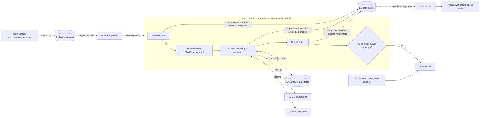
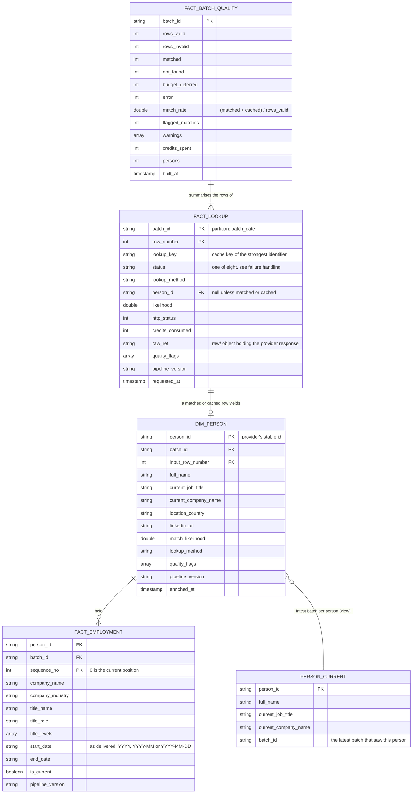

# people-enrichment-pipeline

Serverless ETL on AWS that takes a CSV of event registrants (first name, last name,
optionally email, company, location or LinkedIn URL), enriches each person through a free
people-profile API, and lands analyst-ready Parquet tables in S3, registered in Glue and
queryable in Athena: who the individuals are, which companies they have worked at and
which roles they have held. Everything is provisioned with Terraform, nothing is reachable
from the internet, and the whole thing runs inside AWS Free-plan credits and the
provider's free monthly credits.

**Status:** `v1.3.1`. Built and verified on a personal AWS Free-plan account on
2026-09-25 and 2026-09-26 with live People Data Labs data; destroyed and rebuilt from
nothing twice on 2026-09-26 to prove reproducibility; every change since has deployed from
CI, and the last live exercise was the erasure run on 2026-09-27. [PLAN.md](PLAN.md) is the build plan with
its phase log; `docs/adr/` holds the decision records; [docs/architecture.md](docs/architecture.md)
has the component and IAM detail.



## Contents

1. [Brief coverage and additions](#brief-coverage-and-additions)
2. [For reviewers: ten minutes](#for-reviewers-ten-minutes)
3. [Quick start](#quick-start)
4. [Architecture](#architecture)
5. [Data model and the three questions](#data-model-and-the-three-questions)
6. [Assumptions](#assumptions)
7. [Failure handling and API limits](#failure-handling-and-api-limits)
8. [Data guards](#data-guards)
9. [Security](#security)
10. [Cost](#cost)
11. [Development](#development)
12. [Limitations and next steps](#limitations-and-next-steps)
13. [Appendix: provider findings and live runs](#appendix-provider-findings-and-live-runs)

## Brief coverage and additions

The brief asked for a serverless AWS pipeline that enriches an event's registration list
(first and last names) through a free people-profile API, extracts the individuals and
their employment history, cleans and stores the result in a format a data engineer or
analyst can use, is provisioned entirely with Terraform, runs when triggered, allows no
public access, is version-controlled with best practices, and comes with a README on the
architecture, the assumptions and the handling of failures and API limits. Everything in
it is built and verified; the first table maps each item to where it lives. The second list
is what we added on our own initiative, none of it required by the brief and none of it
costing anything on the free plan.

**What the brief asked for**

| Brief | Where it is |
|---|---|
| A serverless pipeline on AWS, any services | Step Functions, Lambda, S3, EventBridge, DynamoDB, SNS, Glue and Athena ([Architecture](#architecture)) |
| Enrich names from an event registration system through a free people-profile API | People Data Labs on its free plan behind a provider interface, using email, LinkedIn URL, company and location when a row has them ([Assumptions](#assumptions), [ADR 0001](docs/adr/0001-enrichment-provider.md)) |
| Complete the whole project on free credits | self-imposed ceilings below the plan's allowance, a lookup cache, a per-batch cap; about 25 of the month's 100 enrichment credits used across every live run ([Cost](#cost), [Appendix](#appendix-provider-findings-and-live-runs)) |
| Extract individuals and their employment history | `dim_person` and `fact_employment`, one row per position with company, title, seniority levels and dates ([Data model](#data-model-and-the-three-questions)) |
| Clean the data and store it in a format easy for a data engineer or analyst | data guards on the way in; Parquet in S3 registered in Glue and queried with SQL in Athena; saved queries and the `person_current` view ([Data guards](#data-guards), [Data model](#data-model-and-the-three-questions)) |
| Answer who the individuals are, which companies they worked at, which roles they held | saved queries 1 to 3 and the `person_current` view, verified against live data on 2026-09-26 ([Data model](#data-model-and-the-three-questions)) |
| Terraform for all infrastructure and services; code runs when triggered | `infra/` (a bootstrap stack and the dev stack over five modules); an S3 upload is the trigger; the stack was destroyed and rebuilt from nothing twice ([Quick start](#quick-start), [Development](#development)) |
| VPCs assumed present; focus on configuration and security of the other services | outbound HTTPS only, so no VPC is needed; `lambda_vpc_config` attaches the functions to existing subnets when required; one least-privilege role per principal ([Assumptions](#assumptions), [Security](#security)) |
| Ingestion is our choice | a CSV copied to the landing bucket, with header aliases and a published input contract ([Quick start](#quick-start), [Data guards](#data-guards)) |
| No public access to the application | no API or function URL, public access blocked at bucket and account level, an IAM-only trigger ([Security](#security)) |
| Version control with best practices | protected `main`, pull requests with a review before each and a checklist template, conventional commits, a changelog with a GitHub Release per tag, pinned actions, secret scanning with push protection and CodeQL, repository settings applied from a script, tests with a coverage floor in CI ([Development](#development)) |
| README on architecture, assumptions, failures and API limits | the three sections of those names |

**Added on our own initiative**

- **Reliability.** A per-row idempotency cache with a two-upload proof; one execution per
  upload against duplicate S3 and EventBridge deliveries; rows whose invocation crashed still
  reach the audit table; a circuit breaker for provider outages; retries with header-driven
  waits; quarantine and redrive for rejected files; replay tooling with a `pipeline_version`
  on every row ([Failure handling](#failure-handling-and-api-limits)).
- **Credit protection.** Monthly ceilings per credit pool, a per-batch cap, a provider-402
  marker, month-to-date gauges with alarms at 90 % ([Failure handling](#failure-handling-and-api-limits)).
- **Data quality.** Four layers of data guards, `quality_flags` on every row, a
  `fact_batch_quality` history table, the generated input contract with its dry-run
  command, an optional consent column ([Data guards](#data-guards)).
- **Observability and cost control.** Nine alarms, a dashboard, an AWS Budget on gross
  usage before credits, a $1 cost-anomaly subscription, custom metrics kept within the free
  ten, and the cost measured rather than estimated: three cents for September ([Cost](#cost)).
- **Security beyond "no public access".** Per-principal least privilege verified with IAM
  Access Analyzer, TLS-only and encrypted buckets, an account-level public-access block, an
  append-only raw layer, the API key kept out of Terraform state, an external-access
  analyzer, execution logs without payloads, and a right-to-erasure command that removes a
  person from every layer, purges object versions and leaves a tombstone ([Security](#security)).
- **Delivery.** CI with lint, tests, Terraform validation, tflint, checkov and gitleaks;
  deploys from GitHub Actions through OIDC roles with a plan comment on every pull request,
  apply on merge gated by a zero-credit run, and daily drift detection; CodeQL, secret
  scanning with push protection, Dependabot alerts and the other repository settings
  applied from a script; a changelog with a GitHub Release per tag; pre-commit hooks that
  mirror CI ([Development](#development), [ADR 0005](docs/adr/0005-ci-deploys-with-oidc.md)).
- **Testing.** 172 tests (97 % line coverage, 90 % floor in CI) across pure logic,
  property-based invariants (Hypothesis, which found a crash on a stray carriage return),
  provider contracts on recorded fixtures and handlers on mocked AWS; a smoke test of the
  deployed functions; end-to-end runs that count the batch in Athena and gate every CI
  deploy; the idempotency proof; the IAM check; state-machine validation on every pull
  request; two destroy-and-rebuild proofs; a laptop plan that matches the CI deploy byte
  for byte; a live erasure run ([Development](#development)).
- **Analytics extras.** Partition projection instead of crawlers, six saved queries, the
  `person_current` view, and a local DuckDB path that answers the same questions without an
  AWS account ([Data model](#data-model-and-the-three-questions)).
- **Documentation.** A ten-minute reviewer path and an offline demo, five decision
  records, an architecture document, an entity diagram of the data model, an operations
  runbook, generated Terraform module docs, a changelog, a contributing guide and a
  security policy, and the plan with its phase log and every deviation
  ([docs/](docs/), [CHANGELOG.md](CHANGELOG.md), [PLAN.md](PLAN.md)).

## For reviewers: ten minutes

Nothing here needs an AWS account until the last step.

1. **Run it** (three minutes, offline). `make setup`, then `make demo`: the sample file goes
   through the mock provider, which replays a strong match, ambiguous candidates, a
   not-found after a one-off rate limit, a cache hit on a repeated name and an invalid row;
   the messy export goes through the input guards alone (salvaged fields, rejected rows and
   the reason for each); then DuckDB answers the three questions from the Parquet written
   under `out/demo`. `make check` runs the 172 tests in under fifteen seconds.
2. **See the guards on your own file** (one minute). `make validate INPUT=registrants.csv`
   is the same dry run on any export: what would be accepted, salvaged or rejected before
   anything is enriched or spent.
3. **Read** (four minutes). The [brief coverage table](#brief-coverage-and-additions)
   above, the [step-by-step flow](#architecture), [failure handling and API limits](#failure-handling-and-api-limits),
   and the [runbook](docs/runbook.md), which is what an operator opens when an alert
   arrives. The five [decision records](docs/adr/) hold the reasoning behind the provider,
   the orchestrator, the storage format, the idempotency design and the CI deploys.
4. **Check the process** (two minutes, on GitHub). Every change since the first commit is a
   reviewed pull request with green checks and, for infrastructure, a `terraform plan`
   comment; each tag has a [release](https://github.com/gamiest-truisms0t/people-enrichment-pipeline/releases)
   with notes from the [changelog](CHANGELOG.md); the Actions tab shows the deploy gate on
   every merge and the daily drift check; the Security tab shows CodeQL, secret scanning
   and Dependabot.
5. **With an AWS account** (twenty minutes and a few cents of credit): the
   [deploy steps](#deploy-to-aws) below, then `make e2e` and `make athena-verify` against
   the real stack.

## Quick start

**Prerequisites:** Terraform ≥ 1.16, AWS CLI v2, `uv`, `jq`, GNU make; an AWS account
(a new account on the Free plan cannot be charged) with a CLI profile named `enrich-dev`
(`aws login --profile enrich-dev` gives 12-hour browser-based sessions, no access keys);
a People Data Labs free-plan API key for live runs (`make run` works without one). On macOS,
`scripts/setup-tools.sh` installs the tools (Homebrew, Terraform, the AWS CLI, `gh`, tflint,
gitleaks, `uv`, checkov, pre-commit) and is safe to re-run.

### Locally, no AWS account

```bash
make setup                              # uv sync + git hooks
make check                              # ruff + 172 tests (unit, property-based, provider contract, mocked-AWS handlers)
make coverage                           # the same tests with line coverage (97 %; CI enforces a 90 % floor)
make demo                               # the sample file through the mock provider, the guards' dry run on dirty.csv, the three questions
make run                                # data/sample/names.csv through the offline mock provider -> ./out
make run INPUT=data/sample/dirty.csv    # the data guards at work: salvaged fields, rejected rows, warnings
make validate INPUT=registrants.csv     # dry-run the input contract on a file before uploading it
make query                              # the three questions answered from ./out with DuckDB
```

### Deploy to AWS

```bash
make login          # browser sign-in for a 12-hour CLI session
make bootstrap      # once per account: Terraform state bucket + account-level S3 public access block
cp infra/envs/dev/terraform.tfvars.example infra/envs/dev/terraform.tfvars   # set alert_email, provider_name
make init           # point infra/envs/dev at the state bucket (native S3 locking)
make apply          # package the Lambda code (arm64 wheels from uv.lock) and create ~80 resources
                    # -> confirm the SNS subscription email that arrives
make set-api-key    # push ~/.config/people-enrichment/pdl_api_key into the SSM SecureString
make e2e            # upload the 5-row demo file (about 4 credits the first time, 0 after: the rows are then cached), follow the execution, count the batch in Athena
make athena-verify  # run the six saved queries and the person_current view, print the first rows
make destroy        # tear everything down (dev buckets are force_destroy)
```

The bootstrap stack keeps its own state locally in `infra/bootstrap/terraform.tfstate`
(git-ignored) because there is nowhere else to put it yet; keep that file, or on a second
machine run `terraform -chdir=infra/bootstrap import` for the existing bucket before
`make init`. Every other stack stores state in the bucket with native S3 locking.

For CI deploys from your own fork, three more one-off commands after `make bootstrap`:
`make ci-config` (the Actions variables and the alert-email secret), `make branch-protection`
(the three required checks on `main`) and `make repo-settings` (description, topics, secret
scanning, push protection, Dependabot, CodeQL); see [Development](#development).

Where to look afterwards: the Step Functions console shows one execution per upload; the
data bucket holds `input/`, `raw/`, `results/`, `curated/`, `manifests/<batch_id>.json` and
`quarantine/`; the Athena workgroup `people-enrichment-dev-analytics` has the saved queries;
the CloudWatch dashboard `people-enrichment-dev-pipeline` shows executions, rows and
credits; the alerts email receives failures, batches completed with warnings, and alarm
notifications. From the terminal, `make executions` lists recent runs and
`make report BATCH=<batch_id>` shows every row's outcome.

## Architecture

| Component | Role |
|---|---|
| S3 landing bucket | `incoming/<folder>/<file>.csv` uploads start the pipeline; objects expire after 30 days |
| EventBridge rule | `Object Created` under `incoming/` → `StartExecution`; undeliverable events go to a dead-letter queue |
| Step Functions Standard | `ValidateInput` → `EnrichRows` (inline Map, `MaxConcurrency` 1) → `BuildCurated` → summarise; failures and warnings to SNS |
| 3 Lambda functions (Python 3.13, arm64) | `validate-input` (guards, parsing), `enrich` (matching ladder, cache, budget, provider call; the API key comes from SSM through Powertools with a five-minute cache), `build-curated` (reconciliation, output guards, Parquet through the AWS SDK for pandas layer). Structured JSON logs and EMF metrics through Powertools, X-Ray tracing, one zip built reproducibly from `uv.lock` |
| DynamoDB state table | idempotency cache `lookup#…` (TTL 90 days), monthly and per-batch credit counters `budget#…`, batch claims `batch#…` (one execution per upload), the provider circuit breaker `breaker#…`; provisioned 5/5 |
| SSM SecureString | the provider API key; Terraform creates a placeholder and ignores the value |
| S3 data bucket | `input/`, `raw/` (90-day TTL), `results/`, `curated/<table>/batch_date=…/<batch_id>.parquet`, `manifests/`, `quarantine/` (rejected uploads and rejected-row exports, 90-day TTL), `athena-results/` (7-day TTL) |
| Glue database + Athena workgroup | four tables generated from `schema.py` with partition projection, the `person_current` view; encrypted results, 100 MB scan cutoff, six saved queries |
| SNS topic, CloudWatch, AWS Budget | email alerts; nine alarms; one dashboard; $5 monthly budget and a $1 cost-anomaly subscription; IAM Access Analyzer findings |

**Why these choices** (full reasoning in the ADRs):

- **Step Functions** ([ADR 0002](docs/adr/0002-orchestration.md)) gives one execution per
  batch with a visual history, built-in retry and catch, a concurrency cap for the
  provider's rate limit, and a natural "batch complete" point to write one Parquet file per
  table. Retries for provider errors live inside the function, so they cost no state
  transitions and the same code runs locally.
- **Parquet + Glue + Athena** ([ADR 0003](docs/adr/0003-storage-format.md)): typed,
  columnar, plain SQL for analysts, nothing to run, and partition projection means a new
  batch is queryable the moment its file lands, with no crawler.
- **DynamoDB for idempotency and the credit guard** ([ADR 0004](docs/adr/0004-idempotency-and-credit-guard.md)):
  strongly consistent cache hits and atomic counters shared by every invocation, inside the
  always-free capacity.
- **People Data Labs behind a provider interface** ([ADR 0001](docs/adr/0001-enrichment-provider.md)):
  named in the brief, returns dated employment history, has a free sandbox; the mock
  provider exercises every outcome offline.

**One upload, step by step**

1. An operator (or any IAM principal allowed to write to the landing bucket) copies a CSV
   under `incoming/`. Nothing else starts a run: there is no API, no function URL, no
   schedule.
2. S3 notifies EventBridge; the rule starts one Step Functions execution with the bucket,
   key and object version. A duplicate delivery of the same event starts a second execution
   that stops at `DuplicateIgnored` as soon as it sees the batch is already claimed.
3. `ValidateInput` reads the object, applies the file-level guards (size, encoding,
   delimiter, header, share of rejected rows), claims the batch in DynamoDB, exports
   rejected rows to `quarantine/rows/`, writes the parsed input to `input/` and returns the
   valid rows inline. A file that fails as a whole is copied to `quarantine/files/` with the
   reason and the execution fails.
4. The Map runs `enrich` once per row, one row at a time: cache lookup, then the credit
   ceilings and the circuit breaker, then the provider call by the strongest identifier
   (email, LinkedIn URL, name plus company or location, name alone) with header-driven
   retries; the raw response goes to `raw/`, the result to `results/`, and the cache and
   counters are updated.
5. `BuildCurated` reads the parsed input and every result, records any row that produced
   no result as `error`, runs the output checks, and writes the four Parquet files under
   `curated/` plus the manifest with its quality report.
6. The execution succeeds. If a row crashed or the quality report has warnings, the alerts
   email lists them. Athena sees the new partition immediately through partition
   projection; `person_current` and the saved queries answer the brief's three questions.

## Data model and the three questions

One Parquet file per table per batch, Hive-partitioned by `batch_date`. Columns are
declared once in `src/enrich_pipeline/schema.py`; the transform, the Parquet writer and the
Glue tables (`make glue-columns`, drift fails a test) all derive from it.

| Table | One row per | Key columns |
|---|---|---|
| `dim_person` | matched person per batch | `person_id`, `batch_id`, `full_name`, `current_job_title`, `current_company_name`, `location_country`, `linkedin_url`, `match_likelihood`, `lookup_method`, `quality_flags`, input lineage (`input_first_name`, …) |
| `fact_employment` | position held | `person_id`, `batch_id`, `sequence_no` (0 = current), `company_name`, `company_industry`, `title_name`, `title_role`, `title_levels`, `start_date`, `end_date`, `is_current` |
| `fact_lookup` | input row, valid or not | `batch_id`, `row_number`, `status`, `lookup_method`, `person_id`, `likelihood`, `http_status`, `error_message`, `credits_consumed`, `raw_ref`, `quality_flags` |
| `fact_batch_quality` | batch build | `batch_id`, `rows_valid`, `rows_invalid`, per-status counts, `match_rate`, `flagged_matches`, `warning_count`, `warnings`, `credits_spent`, `persons`, `built_at` |

Every row also carries `pipeline_version`, the package version that produced it, so a
rebuild after a transform change (`make rebuild-all`, no provider calls) is visible in the
data.



`fact_lookup` is the audit trail: every input row, valid or not, gets exactly one row per
batch. `dim_person` and `fact_employment` exist only for matched rows and are per-batch
snapshots; `person_current` collapses them to the latest row per person across every
upload. `fact_batch_quality` is the manifest's quality report as a table (a subset of its
columns is shown).

The saved Athena queries (also in [docs/athena_queries.sql](docs/athena_queries.sql)):

```sql
-- 1. Who are the individuals identified?
SELECT full_name, current_job_title, current_company_name, location_country,
       match_likelihood, quality_flags
FROM people_enrichment_dev.dim_person
WHERE batch_date = '2026-09-25';

-- 2. What companies have they worked at?
SELECT p.full_name, e.company_name, e.company_industry, e.start_date, e.end_date, e.is_current
FROM people_enrichment_dev.fact_employment e
JOIN people_enrichment_dev.dim_person p
  ON p.person_id = e.person_id AND p.batch_id = e.batch_id AND p.batch_date = e.batch_date
ORDER BY p.full_name, e.sequence_no;

-- 3. What roles have they held?
SELECT p.full_name, e.title_name, e.title_role, e.title_levels, e.company_name
FROM people_enrichment_dev.fact_employment e
JOIN people_enrichment_dev.dim_person p
  ON p.person_id = e.person_id AND p.batch_id = e.batch_id AND p.batch_date = e.batch_date
ORDER BY p.full_name, e.sequence_no;
```

Query 4 is the operational view (status, method, credits per batch), query 6 trends
`fact_batch_quality` over time, and query 5 is the
**latest snapshot per person**, because `dim_person` is a per-batch snapshot: a person
uploaded twice appears once per batch. The same logic is also a Glue view,
**`person_current`**, created by Terraform, so `SELECT * FROM person_current` answers
"who are the individuals" across every upload with one row per person. `make athena-verify` runs all six and the view; on 2026-09-26,
on the rebuilt stack, they each scanned 9 to 34 KB in under 1.4 s. The largest live batch answers question 1
with 17 public-company executives, and questions 2 and 3 with their dated positions and
titles (for example Nasdaq, executive vice president of corporate strategy, VP level).

## Assumptions

Written so a reviewer can disagree with them; each one names its consequence.

**About the input**

- The file is a registration list: one row is one person, `first_name` and `last_name`
  are always present, and `email`, `company`, `location`, `linkedin_url` and `consent`
  appear when the registration system has them. Header spellings vary (`First Name`,
  `Surname`, `E-mail`, `Organisation`, `LinkedIn`, `opt_in`); the pipeline maps them and
  ignores unknown columns with a warning. The exact contract is
  [docs/input-contract.json](docs/input-contract.json).
- The brief's objective says "email addresses" while its problem statement gives names.
  The pipeline does not choose: each row is looked up by the strongest identifier it has,
  email, then LinkedIn URL, then name plus company or location, then name alone.
- A name alone does not identify a person. Name-only rows use the provider's identify call
  behind a confidence gate (top candidate scored at least 70 and 20 points clear of the
  runner-up); anything less is recorded as `ambiguous`, never guessed. Names are normalised
  before they are sent or cached (Unicode NFKC, case-folded, punctuation and whitespace
  collapsed), accents kept, so `José` and `Jose` are two lookups; the check that compares an
  input surname with the matched profile is accent-insensitive.
- A file has at most 500 rows, because the inline Map carries them. A larger export is
  split before upload, or the design moves to Distributed Map.
- Exports are not clean. A row with a usable name is kept even when its optional fields are
  bad (the field is dropped with a note); only unusable names, explicit consent refusals and
  files that as a whole do not match their header are rejected. [Data guards](#data-guards)
  has every rule.

**About the provider**

- People Data Labs' free plan grants 100 enrichment credits and 5 identify credits a month;
  enrichment bills only a match, identify bills every call. The pipeline caps itself at 70
  and 2 a month and 40 per batch, so one run can never spend what the next one needs. The
  counters are keyed by calendar month and reset with it.
- Correct name-plus-company matches for well-known people score about 4 on the provider's
  1 to 10 likelihood scale, so the threshold is 4. That is a recall-over-precision choice:
  a few matches at 4 are wrong, and every person row carries `match_likelihood` and
  `quality_flags` so an analyst can tighten it downstream without re-querying.
- Provider data is stored as delivered, not corrected. A stale "current job", a wrong
  country or a malformed employment date is flagged (`match.*` quality flags), never
  edited; the raw response is kept for 90 days so a rule change can be replayed with
  `make rebuild-all` at no credit cost.
- The provider is a dependency, not a design constraint. The adapter interface, the mock
  provider and the recorded sandbox fixtures keep the pipeline runnable and testable if the
  credits run out or the plan changes; the free plan obscures contact and fine-grained
  location fields, which the pipeline never stores anyway. Eight providers were compared in
  [ADR 0001](docs/adr/0001-enrichment-provider.md).
- Credit accounting trusts the provider's `x-call-credits-spent` header, and assumes one
  credit when the header is missing on a billable call. The DynamoDB counter is the source
  of truth for the guard; the provider's `x-totallimit-remaining` is shown by `make report`
  but not reconciled, because it includes spend from outside this pipeline.

**About the platform**

- One AWS account, one region (`ap-southeast-1`), one environment (`dev`), on the Free plan,
  which cannot be charged. Another environment is a copy of `infra/envs/dev` with its own
  state key and an entry in the bootstrap stack's `environments` list.
- The functions run outside a VPC: they make outbound HTTPS calls only, and a VPC attachment
  would need a NAT gateway, which is not free. `lambda_vpc_config` attaches them to existing
  private subnets when a network boundary is required.
- Everything in AWS is created by Terraform except two things: the value of the provider API
  key (set out of band into SSM with `make set-api-key`, never in git or state) and the
  click on the SNS confirmation email. The GitHub side is scripted rather than Terraformed:
  `make ci-config` writes the Actions variables and the alert-email secret,
  `make branch-protection` applies the required checks, `make repo-settings` the
  description, topics and security features.
- Deploys come from `main` through GitHub Actions and OIDC roles. A laptop `make apply`
  still works and is reported by the daily drift check the next morning.

**About the data and privacy**

- Only what the three questions need is stored: names, employer and title history,
  country, LinkedIn URL, match score and input lineage. Contact details, birth dates and
  fine-grained location are never stored; logs carry ids and counts, not names.
- `dim_person` is a per-batch snapshot: a person uploaded twice appears once per batch, by
  design, so each upload is reproducible; `person_current` and saved query 5 give one row
  per person across uploads.
- Retention is a starting point, not a policy: raw responses 90 days, landing uploads 30,
  quarantine 90, Athena results 7, cache entries 90; the curated tables are kept. Enriching
  event registrants in production needs a lawful basis (PDPA or GDPR) and a records-of-
  processing entry; the optional `consent` column and `require_consent` are the hook for it.
- **Right to erasure.** `make erase EMAIL=… | NAME="First Last" | PERSON_ID=…` finds every
  batch that holds the person (by the provider's id, by email or by name, accents and case
  folded), deletes their lookup results and raw provider responses, rewrites the parsed
  input and the rejected-rows export without them, drops their cache entries so the next
  upload cannot bring the profile back for free, rebuilds the curated tables and the
  manifest of each affected batch through the deployed function, and purges every
  noncurrent object version (the bucket is versioned, so a plain delete would keep the
  bytes). A tombstone `erasure#<request id>` in the state table records counts, the actor
  and a hash of the identity, never the identity. `DRY_RUN=1` previews. The operator's
  upload in the landing bucket is reported, not touched: it is their file and it expires
  after 30 days. It runs as a human with the deployer's permissions; the pipeline's own
  roles cannot delete under `raw/`.

## Failure handling and API limits

Four rules shape every case below. A bad row never stops the batch. A batch never spends
the month's credits. Nothing is retried at the price of a credit. And every input row ends
in `fact_lookup` with a status and a reason, so "what happened to row 17" is always a query.
Outcomes surface in three places: the status columns of `fact_lookup` and
`fact_batch_quality`, the batch manifest under `manifests/`, and the alerts email
(execution failures, "completed with warnings", alarms).

**Row statuses** (`fact_lookup.status`, one row per input row):

| Status | Meaning | Cached for next time | Credits |
|---|---|---|---|
| `matched` | the provider returned a profile that passed the confidence gate | yes | 1 |
| `cached` | served from an earlier lookup of the same normalised key | it is the cache | 0 |
| `not_found` | the provider has no record (HTTP 404) | yes | enrich 0, identify 1 |
| `ambiguous` | identify candidates below the gate (score under 70 or margin under 20) | yes | 1 |
| `budget_deferred` | a monthly or per-batch ceiling, or a provider 402, stopped the call | no | 0 |
| `provider_unavailable` | skipped while the circuit breaker was open | no | 0 |
| `invalid_input` | rejected by the row guards or by consent, before any call | n/a | 0 |
| `error` | 5xx or transport failure after retries, or the invocation crashed | no | 0 |

| Concern | What the pipeline does | Where you see it |
|---|---|---|
| Rate limit (HTTP 429) | The enrich function reads the provider's `x-ratelimit-reset` (a UTC timestamp at this provider) or `Retry-After`, sleeps until the window reopens (capped at 20 s) and retries, three attempts inside its 90 s timeout. `MaxConcurrency` 1 keeps even an all-name-only batch under the 10-per-minute identify limit. | `attempts` on the row; execution time on the dashboard |
| Transient 5xx or network errors | Backoff inside the function (2 s, then 4 s, capped at 20 s), three attempts; the Map retries Lambda service errors (2 s, ×2, jitter, 3 attempts). Every call is idempotent through the cache key, so a retry never double-spends, and the provider does not bill 5xx responses. | `error` rows with `http_status` and `error_message` |
| Provider outage (a run of failures) | A circuit breaker shared across invocations (`breaker#pdl` in DynamoDB) opens after 3 consecutive failures for 300 s. Rows in that window are `provider_unavailable` without a call and are not cached, so a re-upload or `make redrive` retries them. Any successful response closes it. | `provider_unavailable` rows; `provider_unavailable:` warning in the manifest and the email |
| Credit exhaustion | Per-pool monthly counters (`enrich` 70, `identify` 2, below the plan's 100 and 5) are checked before every billable call; rows past a ceiling are `budget_deferred` and the batch still completes. A provider 402 marks that pool exhausted for the rest of the month. Counters are keyed by calendar month, so the ceilings reset on the first. | `budget_deferred` rows; `enrich-credits-90pct` and `identify-credits-90pct` alarms; the gauges on the dashboard |
| One upload spending the month | `max_credits_per_batch` (40) is enforced through a per-batch counter beside the monthly ones. | `credit budget: batch cap (40) reached` in `error_message` |
| Duplicate names, re-uploaded files | Normalised lookup key (NFKC, case fold, punctuation and whitespace folded, plus the identifiers and thresholds used) → DynamoDB cache, TTL 90 days; a hit costs nothing and reuses the stored profile. Proof on 2026-09-26: first upload 4 matched, 1 not found, **4 credits**; the same file again, 5 `cached`, **0 credits**, identical persons and positions. | `cached` rows; `credits_spent: 0` in the manifest |
| Duplicate trigger events | S3 notifications and EventBridge deliver at least once. The batch id is derived from the object version and the first execution to claim it (a conditional write) owns it; a second delivery ends in `DuplicateIgnored` with no rows enriched. Verified by starting a second execution with the identical input. | the execution's last state; `duplicate: true` in its output |
| A file the guards reject | The execution fails with the reason, and the file is kept under `quarantine/files/` with that reason as object metadata. `make quarantine` lists it, `make quarantine-get` downloads it, `make redrive` re-submits it as a new object once fixed. | failure email with the quarantine path; `make quarantine` |
| Rows the guards reject or salvage | An unusable name or an explicit consent refusal makes the row `invalid_input`; a bad optional field is dropped with a note and the row continues. Rejected rows are exported to `quarantine/rows/<batch_id>.csv` for the source owner. | `invalid_input` rows with the reason; `quality_flags`; the export path in the manifest and the warnings email |
| Provider payload changes | pydantic models with `extra="ignore"`, obscured `true`/`false` values coerced to null, contract tests against recorded sandbox and live fixtures. Raw JSON is kept, so `make rebuild-all` replays every batch through the current code at no credit cost. | `match.*` flags; `pipeline_version` on every rebuilt row |
| A row's invocation crashes or times out | The Map catches it into an `error` record; `BuildCurated` still runs and writes that row to `fact_lookup` with the Step Functions Error and Cause, so every input row is accounted for. The execution succeeds. | `error` rows; the "completed with warnings" email lists the row numbers |
| Poison inputs, repeated failure | An execution-level Catch publishes to SNS and fails the execution with the original error; anything an asynchronous invocation or EventBridge could not deliver lands on the dead-letter queue. | failure email; alarms on Lambda `Errors`, `ExecutionsFailed`, `ExecutionsTimedOut`, DLQ depth |
| Slow batches | Rows run one at a time: about three minutes per 100 rows that carry a company, while name-only rows are held to the provider's 10 identify calls a minute. An execution slower than `max_execution_seconds` (600) alarms. Function timeouts: `validate-input` 60 s, `enrich` 90 s (room for two rate-limit waits), `build-curated` 300 s; the state machine 1 hour. | `pipeline-execution-time` alarm; execution time on the dashboard |
| Cost leaks | Log retention 14 days; lifecycle rules on `raw/`, `quarantine/`, `athena-results/` and the landing bucket; provisioned DynamoDB inside the free allowance; nine custom metrics inside the free ten; an AWS Budget at $5 (20 % actual, 100 % forecast) and a $1 cost-anomaly subscription; `make destroy` verified. | budget and anomaly emails; the Cost section |

**Alarms** (nine, inside the always-free ten): `<function>-errors` ×3, `pipeline-executions-failed`,
`pipeline-executions-timed-out`, `pipeline-execution-time` (an execution slower than
`max_execution_seconds`, the upload-to-curated freshness objective), `enrich-credits-90pct`,
`identify-credits-90pct`, `dead-letter-queue-not-empty`. The credit alarms watch
month-to-date counters the enrich function publishes after every row; they keep their state
between batches. A CloudWatch dashboard (`people-enrichment-dev-pipeline`) shows executions,
execution time against the objective, rows, credits against the ceilings, Lambda errors and
duration, and the dead-letter queue.

## Data guards

Registration exports are rarely clean, so the pipeline has explicit rules for input that
does not look like what it expects (`src/enrich_pipeline/guards.py`; the full rule table is
under Phase 6b in PLAN.md).

| Layer | What is checked | What happens |
|---|---|---|
| **File** | size (`max_input_bytes`, 5 MB), encoding (UTF-8, UTF-16 with BOM; anything else read as Windows-1252), NUL bytes, delimiter (`,` `;` tab `\|`), CSV syntax (a stray carriage return, an unbalanced quote), required header, extra or duplicate columns | recoverable oddities are accepted and recorded as warnings; a file with no usable header, no rows, only rejected rows, malformed CSV syntax (reported with the line number), or more than `max_invalid_fraction` (50 %) rejected rows **fails the batch** with the reason in the notification email, because it almost certainly is not the layout the header claims |
| **Row** | names: non-empty, no digits, has letters, not an email address, not a placeholder (`test`, `n/a`, `unknown`, a repeated header row…), ≤ 100 chars; email shape; LinkedIn URL shape; company/location placeholders (`self-employed`, `student`, `n/a`…) and length; an optional `consent` column (`opt_in`, `marketing_consent`, …) | a bad **name** rejects the row as `invalid_input` with the field and reason (flag `input.rejected`); a bad **optional** field is dropped and the row continues with a note (`input.email_invalid`, `input.company_placeholder`, …) so a person can still be found by name; an explicit consent **no** rejects the row before any provider call, and `require_consent` rejects a missing answer too |
| **Match** | the matched profile's surname vs the input, missing name or current job, no employment history, likelihood sitting on the threshold, malformed or reversed employment dates | the match is kept and flagged (`match.name_mismatch`, `match.sparse_profile`, `match.likelihood_at_floor`, …) in `quality_flags` on `dim_person` and `fact_lookup`, so analysts can filter or review |
| **Output** | one `fact_lookup` row per input row, unique keys, no orphan employment rows, Parquet row counts and columns re-read after writing | the curated step fails rather than publish inconsistent tables |
| **Batch** | match rate below `min_match_rate` (20 %), ≥ 20 % rows rejected, flagged matches, unrecorded rows, decoding or delimiter fallbacks | listed under `quality` in the batch manifest and in the "completed with warnings" email |

The thresholds are Terraform variables (and `enrich run` flags); the field rules are fixed.
The whole contract is published as [docs/input-contract.json](docs/input-contract.json),
generated from the code (`make input-contract`, drift fails a test), and
`make validate INPUT=file.csv` is the same contract as a dry run: it reports what would be
accepted, salvaged and rejected without enriching or writing anything.
Verified live on 2026-09-26 at zero credits: a file mixing five cached names with four
junk rows completed with 5 `cached`, 4 `invalid_input` and two warnings; a file of nothing
but junk failed at validation with
`no valid rows: all 6 data rows were rejected (first_name: placeholder value x4; …)`.
Every drop, rejection and doubt is queryable:
`SELECT status, error_message, quality_flags FROM fact_lookup WHERE batch_id = …`.

## Security

No public surface: no API Gateway, no Lambda function URLs, no public bucket policies.
Functions are invoked only by the state machine's IAM role, and the only way to start a
run is to write to the landing bucket with IAM credentials. Verified against the account
on 2026-09-26:

- Every bucket (landing, data, Terraform state) blocks all four public-access settings,
  denies non-TLS requests and is SSE-S3 encrypted; the account also carries an
  **account-level S3 Block Public Access** (bootstrap stack) so buckets created outside
  this project are covered too.
- The raw layer is append-only: no pipeline role can delete under `raw/`, and the data
  bucket policy denies deletes there to every other principal except the account's IAM
  users and the CI apply role (so `terraform destroy` still works).
- IAM Access Analyzer's external-access analyzer watches the account's resources for
  public or cross-account access; active findings reach the alerts topic through
  EventBridge. The three GitHub OIDC roles are external access by design, so an archive
  rule keeps their findings out of the alerts.
- One IAM role per principal (three functions, the state machine, the EventBridge rule),
  scoped to the exact prefixes, table, parameter, functions and topic it touches
  ([docs/architecture.md](docs/architecture.md#iam-scope-per-principal)). `make iam-check`
  lists every wildcard-resource statement and runs IAM Access Analyzer: no ERROR or
  SECURITY_WARNING findings; the only wildcards are X-Ray, `cloudwatch:PutMetricData`
  (namespace-conditioned) and Step Functions log delivery, none of which support
  resource-level permissions.
- The provider key lives only in the SSM SecureString (AWS-managed key) and on the
  operator's machine; never in git, Terraform state or environment variables. The state
  claim needed a fix: the AWS provider reads a SecureString back **decrypted into state**
  even with `ignore_changes`, so the parameter now uses the write-only `value_wo`
  argument (state holds an empty value, verified) and the older state versions that
  contained the key were deleted from the versioned state bucket. gitleaks runs as a
  pre-commit hook and in CI.
- DynamoDB, SQS and Athena results are encrypted with AWS-owned or managed keys. Customer
  managed KMS keys were deliberately not used ($1 per key per month); the SNS topic is
  unencrypted because CloudWatch alarms cannot publish to a topic encrypted with the
  AWS-managed key, and it carries only ids and counts.
- Execution history is logged without state payloads; the Powertools logs carry ids and
  counts, never names or emails. Root has MFA and no access keys; daily work uses an IAM
  user with browser-based CLI sessions.
- checkov passes 382 checks over `infra/` with one documented skip, and tflint and
  `terraform validate` run on every commit and pull request; every skip is listed with its
  reason in `.checkov.yaml` or inline next to the resource.
- On the repository side: GitHub secret scanning with push protection, CodeQL on every pull
  request and weekly (Python and the workflows), Dependabot alerts and security updates,
  private vulnerability reporting behind a [security policy](SECURITY.md), gitleaks in
  pre-commit and CI, Actions pinned to commit SHAs, and OIDC roles instead of stored AWS
  keys. A person's data can be removed on request with `make erase`
  ([data and privacy](#assumptions)).

## Cost

| | |
|---|---|
| **Measured on 2026-09-27** | after more than twenty batches, two destroy-and-rebuild cycles and every CI deploy: $0.031 of gross usage for September (S3 $0.028, Athena $0.003, everything else under a tenth of a cent), $0.00 net after credits, $139.97 of the Free plan's credit left; Step Functions at 366 of 4,000 free transitions, custom metrics at 0.11 of 10 free metric-months, alarms at 0.29 of 10 |
| **$0 within always-free allowances** | Lambda, Step Functions Standard (4,000 transitions a month), DynamoDB provisioned 5/5, EventBridge, SNS, SSM, Glue Data Catalog, X-Ray, ten CloudWatch alarms, AWS Budgets |
| **Cents, covered by credits** | S3 (a few MB of Parquet and JSON), Athena (queries here scan KB but bill the 10 MB minimum, about $0.00005 each) |
| **$0: custom metrics trimmed to nine** | ten are always free; cold-start and derivable counters were removed (they stop counting the month after), everything else lives in `fact_lookup` and `fact_batch_quality` |
| **$0: cost guards** | the $5 AWS Budget measured on gross usage before credits (the default nets credits, which on a Free plan account reads $0.00 until the credits are gone, so it could never have alerted), a $1 daily Cost Anomaly Detection subscription on the default monitor AWS created for the account, IAM Access Analyzer (external access) |
| **Provider** | 100 enrichment + 5 identify credits a month on the free plan; the pipeline caps itself at 70 + 2. September 2026 after all runs: about 25 enrichment and 3 identify credits used |
| **Deliberately avoided** | NAT gateway (~$33 a month idle), customer-managed KMS keys, Secrets Manager, Glue crawlers and jobs, on-demand DynamoDB, unlimited log retention, Express Workflows |
| **At scale** | Costs grow with rows: provider credits first, then Lambda duration, S3 requests and Athena scans; Step Functions transitions ($0.025 per 1,000) become the largest AWS line above ~40 batches a month |

`make destroy` removes everything in `infra/envs/dev` (buckets are `force_destroy` in dev);
the state bucket and the account-level public access block stay (bootstrap stack).

## Development

```
src/enrich_pipeline/
  models.py normalize.py ingest.py guards.py    input rows, lookup keys, CSV parsing, the data guards
  enricher.py budget_rules.py breaker.py         matching ladder, credit ceilings and batch cap, circuit breaker
  providers/{base,pdl,mock}.py                   provider protocol, People Data Labs adapter, offline mock with fixtures
  schema.py transform.py parquet.py              the four tables from one source of truth, Parquet writer with read-back checks
  raw_store.py runner.py cli.py erasure.py       raw layer, local runner, `enrich run|validate|query|erase`, right to erasure
  aws/{s3,dynamo}.py handlers/                   AWS clients (cache, budgets, batch claims, breaker), the three Lambda handlers
tests/unit tests/handlers tests/fixtures        172 tests, 97 % line coverage; Hypothesis for properties, moto for AWS, respx for HTTP; synthetic fixtures only
infra/bootstrap infra/envs/dev infra/modules/    state bucket, account block and OIDC roles; the dev stack (33 inputs); storage, secrets,
                                                 lambda_function, orchestration, catalog modules; a generated README in each directory
data/sample data/demo                            mock-provider samples (clean and dirty); public-figure demo lists
docs/                                            five ADRs, architecture.md, runbook.md, athena_queries.sql, input-contract.json
scripts/                                         e2e, smoke, idempotency proof, IAM check, Athena verify, quarantine, rebuild-all, batch report,
                                                 input contract, Glue columns, fixtures, CI tfvars, repository settings, release, tool setup
.github/                                         ci, terraform-plan, terraform-apply and terraform-drift workflows; Dependabot; branch
                                                 protection; pull request and issue templates
CHANGELOG.md CONTRIBUTING.md SECURITY.md         changelog, contributing guide, security policy, code of conduct, MIT licence
CODE_OF_CONDUCT.md LICENSE
.pre-commit-config.yaml .checkov.yaml            hooks, checkov skips, tflint rules, terraform-docs settings
.tflint.hcl .terraform-docs.yml
```

- **Everything is a make target** (`make help` lists them; each is safe to run again):

  | Purpose | Targets |
  |---|---|
  | Develop | `setup`, `check`, `lint`, `fmt`, `test`, `coverage`, `precommit`, `clean` |
  | Run offline | `demo`, `run`, `validate`, `query`, `record-fixtures` |
  | Keep generated files current | `input-contract`, `glue-columns`, `tf-docs`, `tf-docs-check`, `tf-lint`, `asl-validate` |
  | Provision | `login`, `whoami`, `bootstrap`, `init`, `package`, `plan`, `apply`, `destroy`, `set-api-key` |
  | Operate | `upload`, `executions`, `report`, `rebuild`, `rebuild-all`, `quarantine`, `quarantine-get`, `redrive`, `erase` |
  | Prove | `smoke`, `e2e`, `idempotency-proof`, `iam-check`, `athena-verify` |
  | Repository | `ci-config`, `branch-protection`, `repo-settings`, `release` |

- **Tests, by layer.** All of it runs on the free plan and on GitHub's free minutes.
  - *Unit* (`tests/unit`): normalisation and lookup keys, the matching ladder, budgets and
    the circuit breaker, the data guards, the transform and Parquet schema, the CLI. Pure
    Python, no AWS, no network.
  - *Property-based* (`tests/unit/test_properties.py`): Hypothesis states the invariants of
    the normalisation and guard functions (idempotence, independence from the Unicode
    form, what a plausible name is, that any text or bytes either parse or raise
    `InputError`) and searches for counterexamples, deterministically in CI. It found the
    carriage-return crash fixed in `v1.2.6`.
  - *Provider contract* (`tests/unit/test_pdl_provider.py`, `test_provider_response.py`):
    the People Data Labs adapter against responses recorded from the sandbox and from live
    calls (`tests/fixtures/pdl`, synthetic data only): status mapping, credit and
    rate-limit headers, obscured fields.
  - *Handler* (`tests/handlers`): the three Lambda handlers chained the way Step Functions
    runs them, against moto-mocked S3 and DynamoDB: the cache, the budgets, the batch
    claim, quarantine, the breaker, the quality table, and the erasure command against
    real handler output with bucket versioning on.
  - *Smoke* (`make smoke`): invokes the three deployed functions directly, in order, on the
    cached demo file, so a broken function is isolated from a broken trigger.
  - *End to end* (`make e2e`): uploads the file, follows the execution EventBridge starts,
    and counts the batch's rows in Athena; the CI deploy runs it as its gate after every
    apply, at zero credits.
  - *Proofs and checks* (`make idempotency-proof`, `make iam-check`, `make athena-verify`,
    `make rebuild-all`, `make asl-validate`): the re-upload costs nothing, no IAM policy
    has a wildcard resource it does not need, the saved queries and the view answer, every
    batch rebuilds from stored results, the state machine definition is valid.

  `make check` runs the first four layers (172 tests, under fifteen seconds); `make coverage`
  adds line coverage, 97 % at `v1.3.1`, and CI fails below 90 %.
- **CI** (GitHub Actions, pinned to commit SHAs): lint + tests with the 90 % coverage floor
  and a summary on every run, `terraform fmt`/`validate`, tflint, checkov, the terraform-docs
  staleness check, and a gitleaks scan. The plan workflow also validates the state-machine
  definition with the Step Functions API, and CodeQL analyses Python and the workflows on
  every pull request and weekly. `main` is protected: the three CI checks must pass and the
  branch must be current; no force pushes; branches are deleted on merge. Dependabot watches
  actions, `uv.lock` and Terraform providers weekly.
- **Repository settings as code.** `make branch-protection` applies
  `.github/branch-protection.json`; `make repo-settings` (`scripts/repo_settings.sh`)
  applies the description and topics, branch deletion on merge, secret scanning with push
  protection, Dependabot alerts and security updates, private vulnerability reporting and
  CodeQL default setup for Python and the workflows, all through the GitHub API, so a fork
  gets the same posture in one command. Both are idempotent.
- **Operations.** [docs/runbook.md](docs/runbook.md) maps every alert (the two execution
  emails, the nine alarms, an Access Analyzer finding, the budget and anomaly emails, a
  failed drift check) to what it means, the first command to run and the way back, and
  covers the routine jobs: key rotation, reprocessing, quarantine, teardown and rebuild.
- **Terraform documentation.** Each stack and module has a README whose requirements,
  resources, inputs and outputs tables are generated by terraform-docs (`make tf-docs`,
  also a pre-commit hook); `make tf-docs-check` fails CI when one is stale.
  [infra/envs/dev/README.md](infra/envs/dev/README.md) is the full list of the 33 knobs:
  credit ceilings, guard thresholds, retention, the freshness objective, VPC attachment.
- **Deploys from CI, no stored keys** ([ADR 0005](docs/adr/0005-ci-deploys-with-oidc.md)).
  Three OIDC roles from the bootstrap stack: a pull request gets a `terraform plan`
  comment rendered without refreshing (the role can only read the state); a merge to
  `main` plans, applies the saved plan and then runs the zero-credit demo batch as the
  deploy gate; a daily drift job refreshes with a read-only role and fails when the
  account differs from `main`. `make ci-config` publishes the variables and the
  alert-email secret the workflows need.
- **Pre-commit** mirrors CI: ruff check and format, gitleaks on the staged changes,
  terraform fmt/validate/tflint/checkov and terraform-docs on changed Terraform, plus
  whitespace, end-of-file, YAML/TOML/JSON, large-file, merge-marker, private-key and
  AWS-credential checks.
- **Branching and versions.** Work happens on `feat/*` branches merged by PR after a
  code review; commits follow Conventional Commits; milestones are tagged (`v0.0.1` local
  pipeline, `v0.1.0` end to end with the mock, `v0.2.0` live provider, `v0.3.0` Athena,
  `v0.4.0` hardening, `v1.0.0` submission, `v1.1.0` production practices, `v1.2.0` the $0
  pass, `v1.2.1` to `v1.2.3` documentation and test polish, `v1.2.4` repository surface,
  `v1.2.5` reviewer and operator docs, `v1.2.6` property tests and reproducible builds,
  `v1.3.0` right to erasure, `v1.3.1` the submission snapshot). Changes after `v1.0.0`
  continue on `main` and are tagged
  `v1.x`; the package version is stamped on every curated row as `pipeline_version`. Every
  version has a section in [CHANGELOG.md](CHANGELOG.md) (Keep a Changelog format), and
  `make release TAG=v1.3.1` creates the tag if needed and publishes
  the GitHub Release with that section as its notes. [CONTRIBUTING.md](CONTRIBUTING.md)
  has the review-before-PR rule and the release steps; the pull request template carries
  the checklist.
- **Reproducibility.** On 2026-09-26 the dev stack was destroyed and re-created from
  `make apply`; a follow-up plan shows no drift, and the pipeline ran end to end on the
  fresh stack. Lambda builds are reproducible across machines: `make package` drops the
  console scripts, whose shebang names the installing interpreter's path, together with
  the RECORD lines that hash them, so a laptop `make plan` after a CI deploy of the same
  commit shows no function changes.

## Limitations and next steps

- **Match precision at the threshold.** Correct name-plus-company matches for well-known
  people score about 4 on the provider's 1 to 10 likelihood scale, so the threshold is 4
  and a few matches are wrong (one Mary Barra row matched a plant manager at a GM plant).
  Every person row carries `match_likelihood` and `quality_flags`; raising the threshold to
  5 removes those rows but also loses true matches that scored 4.
- **Provider data as delivered.** "Current job" occasionally points at a secondary record
  (a board seat), some people have employment history but no current title, and
  `location_country` is sometimes wrong. `fact_employment` carries the full dated history;
  the `match.sparse_profile` flag marks the thin ones.
- **Identify credits.** Five a month makes name-only enrichment nearly unusable on the
  free plan; the design would take a second provider for that rung (Diffbot Enhance
  accepts bare names, 400 free lookups a month) behind the same interface.
- **Scale.** Inline Map caps a file at 500 rows and one Parquet file per table per batch
  means small files at thousands of batches. Distributed Map with an S3 item reader and
  Iceberg tables (or periodic compaction) are the paths there.
- **Next steps** in rough order: the Diffbot fallback for name-only rows; PDL Company
  Enrichment into a `dim_company` table; a suppression list so an erased person who
  registers again is not re-enriched without fresh consent; dbt-athena models for analyst
  marts; LocalStack for offline integration tests.

## Appendix: provider findings and live runs

`PdlProvider` talks to two endpoints over `httpx`: `GET /v5/person/enrich` for email,
LinkedIn URL, or name plus company/location, and `GET /v5/person/identify` for name-only
rows. The same class serves the free sandbox host (`--sandbox` locally, `pdl_sandbox = true`
in Terraform), which returns synthetic people at zero cost and is where the recorded test
fixtures come from. Findings from the live API that shaped the defaults:

| Finding | Consequence |
|---|---|
| Enrichment and Identify are **separate credit pools**: 100 enrichment credits a month but only **5 identify credits** | Separate monthly ceilings (`max_enrich_credits` 70, `max_identify_credits` 2) and a per-pool HTTP 402 marker |
| Enrichment bills only on a 200; a 404 costs nothing. Identify bills every call | Name-only rows are the expensive path; give the input a company or location column |
| Correct name-plus-company matches score a **likelihood of about 4**; a threshold of 6 kept 1 match in 8 | `enrich_min_likelihood` defaults to 4; `match_likelihood` is stored for stricter filtering downstream |
| The threshold is sent to the provider and changes its answer | It is part of the cache key, so tuning it re-queries instead of replaying cached not-found results |
| The sandbox resolves profile URLs and emails but answers 404 to every name-based lookup | Sandbox fixtures use LinkedIn URLs; name-based behaviour is verified with recorded live responses |
| The free plan returns contact and fine-grained location fields as `true`/`false` | Coerced to null; contact data is never stored anyway |
| `x-ratelimit-reset` is a UTC timestamp, not a number of seconds | Parsed and slept on, capped at `max_wait_seconds` |

Live runs on 2026-09-25 used `data/demo/registrants.csv`: 28 rows of publicly known
company executives with their employer, plus one name-only row, one deliberately wrong
employer, one duplicate and one invalid row. Public figures were used because their
professional history is public information; no contact fields are stored.

| Run | Rows | Outcome | Enrichment credits | Identify credits |
|---|---|---|---|---|
| Shakedown, threshold 6 | 9 valid | 1 matched, 8 not found | 1 | 1 |
| Threshold diagnostic (local CLI, threshold 2) | 3 | 2 matched at likelihood 4, 1 not found | 2 | 0 |
| Demo batch, threshold 4 | 27 valid | **17 matched**, 9 not found, 1 cached | 17 | 1 |
| Idempotency proof (2026-09-26), two uploads | 5 valid | 4 matched + 1 not found, then 5 cached | 4 | 0 |
| **Month to date** | | | **about 25 of 100** | **3 of 5** |

**Live erasure, 2026-09-27.** The right-to-erasure command was exercised on the dev stack
against the synthetic mock-provider "John Doe" that the Phase 3 smoke tests had written into
seven batches, so no real person's data was involved. The dry run listed 7 rows across 7
batches and the seven operator uploads still holding the row; the real run erased them
(1 cache item, 50 object versions), rebuilt all seven batches through the deployed
function (their manifests now carry `pipeline_version` 1.3.0 and one person fewer), and a
second dry run found nothing. The erased result key has no versions left and the rewritten
input documents have no noncurrent versions; the tombstone records 7 rows, 7 batches and
the IAM user that ran it.
