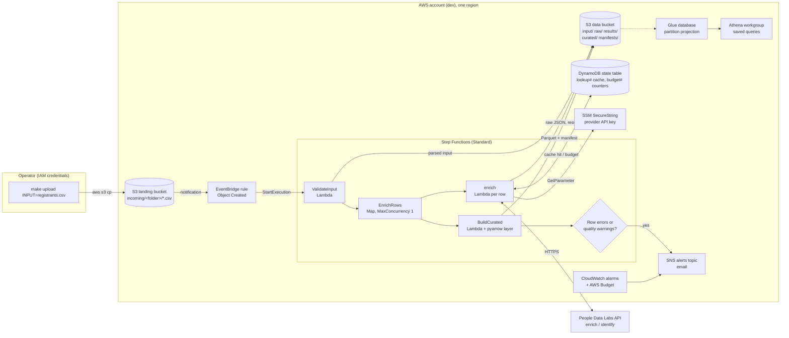

# Architecture

Serverless, event-driven, everything provisioned by Terraform. A CSV upload to the landing
bucket is the only trigger; the curated Parquet tables in the data bucket, registered in
Glue and queryable in Athena, are the output.

## Components

| Component | Role | Free-tier footing |
|---|---|---|
| S3 landing bucket | Upload target; EventBridge notifications on; objects expire after 30 days | cents, covered by credits |
| EventBridge rule | `Object Created` under `incoming/` starts one execution per file; undeliverable events go to the dead-letter queue | free for AWS events |
| Step Functions Standard | One execution per batch: validate → Map(enrich) → build curated → summarise/notify | 4,000 transitions a month free |
| `validate-input` Lambda | Size, encoding, delimiter and header guards; per-row validation and salvage; writes the parsed input | 1M requests / 400k GB-s free |
| `enrich` Lambda | Matching ladder, cache, credit budget, provider call with retries, raw JSON and result objects, month-to-date metrics | same |
| `build-curated` Lambda | Reconciles input vs results, output guards, Parquet tables, manifest, batch quality report | same (pyarrow from the AWS SDK for pandas layer) |
| DynamoDB state table | `lookup#` cache (TTL 90 days), `budget#` counters and 402 markers; provisioned 5 RCU / 5 WCU | inside the always-free 25/25 |
| SSM Parameter Store | The provider key as a SecureString; Terraform creates a placeholder and ignores the value | free |
| S3 data bucket | `input/`, `raw/` (90-day TTL), `results/`, `curated/`, `manifests/`, `athena-results/` (7-day TTL) | cents, covered by credits |
| Glue Data Catalog | Database and three tables generated from `schema.py`, partition projection over `batch_date` | 1M objects free |
| Athena workgroup | Enforced encrypted results, 100 MB scan cutoff per query, five saved queries | $5/TB scanned, 10 MB minimum: cents |
| SNS topic | Execution failures, "completed with warnings", alarms | free at this volume |
| CloudWatch | Log groups (14-day retention), eight alarms, custom metrics; X-Ray tracing | ten alarms free; 15 custom metrics in use, five beyond the free ten (about $1.50 a month, covered by credits) |
| AWS Budget | $5 a month, alerts at 20 % actual and 100 % forecast | free |

## Data flow for one batch

1. The operator (or any IAM principal allowed to write to the landing bucket) uploads a
   CSV under `incoming/`.
2. EventBridge starts a Step Functions execution with `{bucket, key}`.
3. `ValidateInput` applies the file-level data guards, parses rows, records rejected rows
   with reasons, writes `input/batch_id=<id>/input.json` and returns the valid rows.
4. The Map invokes `enrich` once per row. Each row: cache lookup → budget check → provider
   call (email → LinkedIn URL → name + company/location → name only) → raw JSON to `raw/`,
   result to `results/`, cache and counter updated.
5. `BuildCurated` reads the parsed input and the results, adds `error` rows for any row
   that crashed, runs the output checks, writes the three Parquet files and a manifest
   with a quality report.
6. The execution succeeds; if any row crashed or the quality report has warnings, an SNS
   email lists them. Athena sees the new partition immediately.

## Security posture

- No public surface: no API Gateway, no Lambda function URLs, no public bucket policies.
  Functions are invoked only by the state machine (IAM role), and the only way to start a
  run is to write to the landing bucket with IAM credentials.
- Every bucket blocks public access, enforces TLS and is SSE-S3 encrypted; the account
  also carries an account-level S3 Block Public Access (bootstrap stack).
- One IAM role per principal (three functions, the state machine, the EventBridge rule),
  resource-scoped to the exact prefixes, table, parameter, functions and topic it touches.
  `make iam-check` lists any wildcard-resource statement and runs IAM Access Analyzer.
- The provider key exists only in SSM (SecureString, AWS-managed key) and on the
  operator's machine; never in git, Terraform state or environment variables.
- Execution logging excludes state payloads; Powertools logs carry ids and counts, not
  names or emails. Contact fields from the provider are never stored.
- Functions run outside a VPC (outbound HTTPS only); `lambda_vpc_config` attaches them to
  existing private subnets when a network boundary is required.

## IAM scope per principal

| Principal | Allowed |
|---|---|
| EventBridge rule role | `states:StartExecution` on the one state machine |
| State machine role | `lambda:InvokeFunction` on the three functions, `sns:Publish` on the alerts topic, log delivery, X-Ray |
| `validate-input` | `s3:GetObject` on `landing/incoming/*`, `s3:PutObject` on `data/input/*` |
| `enrich` | `dynamodb:GetItem/PutItem/UpdateItem` on the state table, `s3:PutObject` on `data/raw/*` and `data/results/*`, `ssm:GetParameter` on the key parameter, `kms:Decrypt` on the `aws/ssm` key, `cloudwatch:PutMetricData` in the `PeopleEnrichment` namespace |
| `build-curated` | `s3:ListBucket` (prefix-conditioned) and `s3:GetObject` on `data/results/*` and `data/input/*`, `s3:PutObject` on `data/curated/*` and `data/manifests/*` |
| All functions | `logs:CreateLogStream/PutLogEvents` on their own log group, X-Ray trace upload, `sqs:SendMessage` to the dead-letter queue |
